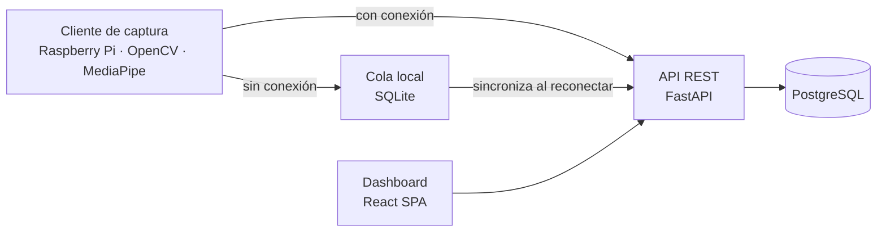

# DriveGuard

Sistema de detección de fatiga y somnolencia en conducción mediante visión por computador, con alertas en tiempo real y un dashboard de supervisión para flotas de transporte público y de carga.

Proyecto de Aula — Ingeniería de Software, Universidad Tecnológica de Bolívar.

## Contexto

La fatiga al volante es un factor de riesgo vial que, a diferencia del alcohol o el exceso de velocidad, no deja evidencia física tras un siniestro y tiende a subregistrarse. Las soluciones comerciales existentes (sistemas DMS de fábrica, dispositivos de posventa) son costosas para flotas pequeñas, operan como cajas negras sin umbrales ajustables, y no ofrecen trazabilidad consultable para el supervisor.

DriveGuard combina MediaPipe Face Mesh y OpenCV para detectar en tiempo real tres señales de fatiga — cierre prolongado de ojos, bostezos y cabeceo —, sobre hardware de bajo costo y sin GPU dedicada. El sistema emite una alerta local inmediata al conductor y registra cada incidente en una plataforma consultable por los supervisores de flota.

## Arquitectura



El cliente de captura nunca depende de la conexión para seguir alertando al conductor: si la pierde en ruta, los eventos se encolan localmente y se sincronizan con el backend al reconectar, sin perder ni duplicar incidentes. El diagrama de componentes y de despliegue completo está en `docs/`.

## Stack

| Componente | Tecnología |
|---|---|
| Visión por computador | Python, OpenCV, MediaPipe Face Mesh |
| Backend / API | FastAPI, SQLAlchemy 2.0, Alembic |
| Base de datos | PostgreSQL |
| Dashboard | React, Vite, TailwindCSS |
| Autenticación | JWT |
| Contenedores | Docker, docker-compose |
| Gestión ágil | GitHub Projects (Scrum + Kanban) |

## Estructura del repositorio

```
.
├── cv-module/      # Cliente de captura y detección de fatiga — ver cv-module/README.md
├── backend/        # API REST, modelos y migraciones — ver backend/README.md
├── frontend/       # Dashboard de supervisión — ver frontend/README.md
├── docs/           # Contrato de API (OpenAPI), diagramas UML, documento de elicitación
└── docker-compose.yml
```

## Decisiones de diseño

- **Usuario unificado para los tres roles** (conductor, supervisor, administrador) en una sola tabla con autenticación, en vez de modelar al conductor como un sujeto sin acceso al sistema: también puede iniciar sesión y consultar sus propios incidentes.
- **El `id` de cada evento se genera en el cliente de captura, no en el servidor.** Permite que el backend inserte con `ON CONFLICT (id) DO NOTHING`, evitando eventos duplicados si el cliente reintenta el envío tras recuperar conexión.
- **No se almacena video ni imágenes del conductor**, solo metadatos del evento (tipo, severidad, duración, métrica), por tratarse de datos biométricos protegidos bajo la Ley 1581 de 2012.
- **El umbral de sensibilidad de cada tipo de incidente es configurable desde base de datos**, no hardcodeado, para que un administrador lo ajuste sin requerir un nuevo despliegue del backend.

## Cómo levantar el entorno

```bash
cp backend/.env.example backend/.env
docker-compose up --build
```

Esto levanta la API REST y PostgreSQL. Para variables de entorno, migraciones, o cómo correr el cliente de captura y el dashboard en desarrollo, ver el README de cada módulo.

## Equipo y metodología

| Integrante | Frente |
|---|---|
| Sebastián David Ruiz Ortega | Visión por computador (cliente de captura) |
| Juan Diego Serpa Medina | Backend (API, autenticación, base de datos) |
| Daniel Sanchez Araujo | Frontend (dashboard) |

Scrum combinado con Kanban, sprints de 2 semanas sobre 12 semanas totales. Backlog priorizado con MoSCoW; seguimiento en la pestaña Projects de este repositorio.
